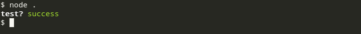

# chalkmark

> Markup for the console - convert HTML-like tags to ANSI escape sequences

## Usage

``` js
const chalkmark = require('chalkmark')

console.log(chalkmark('<b>test?</b> <green>success</green>'))
```



## Available tags

* **`b`** or **`bold`** &mdash; **bold** text
* **`u`** or **`underline`** &mdash; <u>underlined</u> text
* **`s`** or **`strikethrough`** &mdash; ~~strikethrough~~ text
* **`i`** or **`italic`** &mdash; *italic* text
* **`inverse`** &mdash; inverted text (foreground and background reversed)

##### Text colors

* **`black`**
* **`red`**
* **`green`**
* **`yellow`**
* **`blue`**
* **`magenta`**
* **`cyan`**
* **`white`**
* **`gray`**

##### Background colors

* **`bgBlack`**
* **`bgRed`**
* **`bgGreen`**
* **`bgYellow`**
* **`bgBlue`**
* **`bgMagenta`**
* **`bgCyan`**
* **`bgWhite`**
